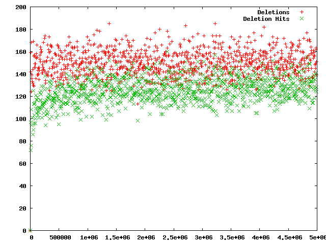
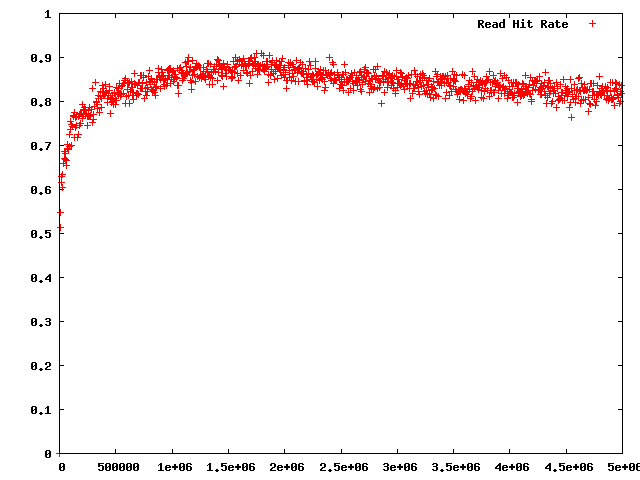
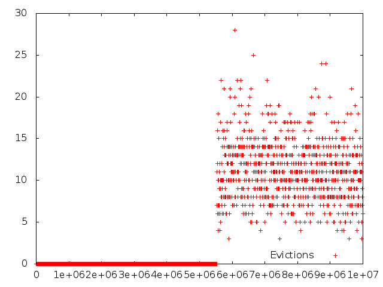
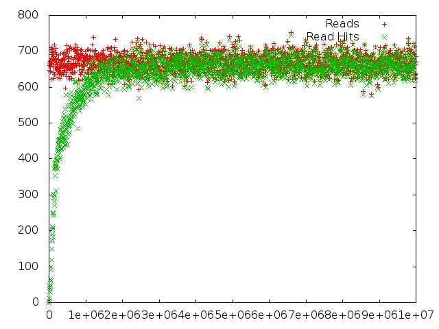
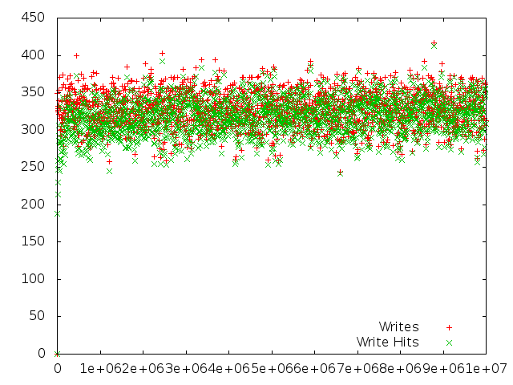

# foocsim

Simple file or object cache simulator

## Installation
In your `GOPATH` type:

```
$ go get github.com/lpabon/foocsim
$ go get github.com/lpabon/godbc
```

## Example

* Run the default simulation

```
$ cd $GOPATH/src/github.com/lpabon/foocsim/foocsim
$ go run foocsim.go
== Cache Information ==
Cache Utilization: 1
Read Hit Rate: 0.8255917615066246
Write Hit Rate: 0.825938701848781
Read hits: 2280012
Write hits: 1229271
Delete hits: 624538
Reads: 2761670
Writes: 1488332
Deletions: 749998
Insertions: 1969990
Evictions: 478575
Invalidations: 1229271
```

* The simulation created a file called `cache.data`
* Run `fooplot.gp` to create graphs using `gnuplot` as follows:

```
$ ./fooplot.gp
```

### Example Plots












## Help

```
$ go run foocsim.go -help
Usage of foocsim:
  -cachesize=64: Cache size in GB. Default 8 GB
  -cachetype="simple": Cache type to use.  Current caches: simple, null
  -chunksize=256: Chunk size in KB. Default 256 KB
  -dataperiod=1000: Number of IOs per data collected
  -deletions=15: % of File deletions
  -ios=5000000: Number of IOs
  -maxfilesize=1048576: Maximum file size MB. Default 1 TB
  -numfiles=100000: Number of files
  -reads=65: % of Reads
  -writethrough=true: Writethrough or read miss
  -zipf_filedistribution=true: Use a Zipf or Random distribution
exit status 2
```
