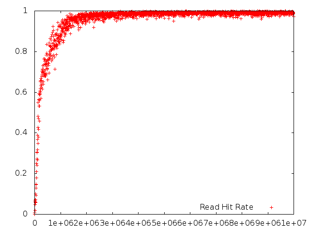

# foocsim

Foocsim is a simple single threaded cache simulator.  It uses an SPC1-like load generator to study the behavior of various cache implementations.

## Installation

### Binary Install
Go to [RELEASES][] and download the Linux x86_64 binary.

### Source Install

Go to your `GOPATH` type:

```
$ go get github.com/lpabon/foocsim
$ cd $GOPATH/src/github.com/lpabon/foocsim
$ go get ./...
$ cd foocsim
$ go build
```

## Example

* Run a simulation using a block size of 4KB and an application page cache of 8MB.

```
$ ./foocsim
go run foocsim.go -cachetype=iocache -blocksize=4 -ios=10000000 -warmup=false -pagecachesize=8 
== Simulation ==
## App 0 ##
== Page Cache ==
Cache Utilization: 91.89 %
Read Hit Rate: 0.0066
Write Hit Rate: 0.3665
Read hits: 44279
Write hits: 1200506
Delete hits: 0
Reads: 6724310
Writes: 3275690
Deletions: 0
Insertions: 9955721
Evictions: 8753333
Invalidations: 1200506
Mean Read Latency: 0.00 usecs
Mean Write Latency: 0.00 usecs
Mean Delete Latency: 0.00 usecs
== Cache ==
Cache Utilization: 17.61 %
Read Hit Rate: 0.9526
Write Hit Rate: 0.9688
Read hits: 6363241
Write hits: 3173650
Delete hits: 0
Reads: 6680031
Writes: 3275690
Deletions: 0
Insertions: 3592480
Evictions: 49518
Invalidations: 3173650
Mean Read Latency: 0.00 usecs
Mean Write Latency: 0.00 usecs
Mean Delete Latency: 0.00 usecs

Total Time: 25.641628781s
```

* The simulation created a file called `cache.data`
* Run `fooplot.gp` to create graphs using `gnuplot` as follows:

```
$ ./fooplot.gp
```

* Run simulation with the iodb backend:

```
$ ./foocsim -cachetype=iodb
== Warmup ==
== Simulation ==
== Cache ==
Cache Utilization: 60.51 %
Read Hit Rate: 0.6440
Write Hit Rate: 0.6466
Read hits: 41800
Write hits: 22692
Delete hits: 0
Reads: 64904
Writes: 35096
Deletions: 0
Insertions: 58200
Evictions: 0
Invalidations: 22692
Mean Read Latency: 172.19 usecs
Mean Write Latency: 77.41 usecs
Mean Delete Latency: 0.25 usecs
== IoDB Information ==
Ram Hit Rate: 0.1095
Ram Hits: 8582
Buffer Hit Rate: 0.2428
Buffer Hits: 19027
Storage Hits: 50766
Wraps: 0
Segments Skipped: 31
Mean Read Latency: 151.11 usec
Mean Segment Read Latency: 0.00 usec
Mean Write Latency: 2596.59 usec

Total Time: 16.462160666s
```

### Example Plots




### Help Screen

```
$ go run foocsim.go -help
Usage of foocsim:
  -bcpercent=0.1:
  Buffer Cache size as a percentage of the cache size
  -blocksize=64:
  Block size in KB.
  -cachesize=8:
  Cache size in GB.
  -cachetype="simple":
  Cache type to use.
  Cache types with no IO backend:
    simple, null, iocache.
  Cache types with IO backends using iocache frontend:
    boltdb, iodb
  -clients=1:
  Number of clients
  -dataperiod=1000:
  Number of IOs per data collected
  -deletions=0:
  % of File deletions
  -iodb_directio=false:
  Use DIRECTIO in iodb
  -iodb_segmentbuffers=32:
  Number of inflight buffers
  -iodb_segmentsize=1024:
  Segment size in KB
  -ios=5000000:
  Number of IOs for each client
  -maxfilesize=8388608:
  Maximum file size MB. Default 8TB.
  -numfiles=1:
  Number of files
  -pagecachesize=0:
  Size of VM page cache above the IO cache in MB
  -randomfilesize=false:
  Create files of random size with a maximum of maxfilesize.
  If false, set the file size exactly to maxfilesize.
  -reads=65:
  % of Reads
  -warmup=true:
  Warmup cache before running simulation
  -warmupstats=false:
  Print stats after warmup stage
  -writethrough=true:
  Writethrough or read miss
```

### Cache Types

#### Caches with no IO generated

* **null**: Caches nothing.  Useful for testing.
* **simple**: Uses Golang maps as key-val store with a CLOCK-like eviction policy.
* **iocache**: Uses data structures described in [Mercury][].

#### Caches which generate IO

* **boltdb**:  Uses [BoltDB][]
* **iodb**: Uses data structures based on [Mercury][].

[Mercury]: http://storageconference.us/2012/Papers/04.Flash.1.Mercury.pdf
[BoltDB]: https://github.com/boltdb/bolt
[RELEASES]: https://github.com/lpabon/foocsim/releases
