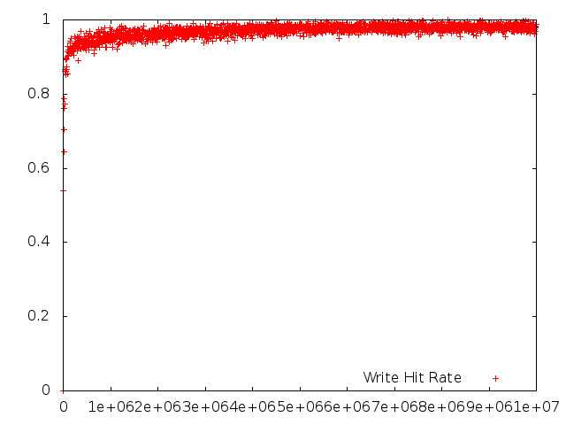
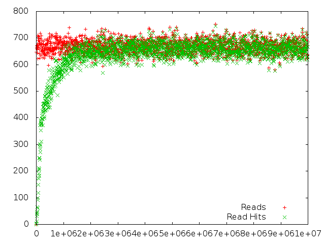

# foocsim

Foocsim is a simple single threaded cache simulator.  It uses a ZipF load generator to study the behavior of various cache implementations.

## Installation
You will need to have leveldb and rocksdb development headers and libraries installed.  Then, in your `GOPATH` type:

```
$ go get github.com/lpabon/foocsim
$ cd $GOPATH/src/github.com/lpabon/foocsim
$ go get ./...
```

## Example

* Run the default simulation

```
$ cd $GOPATH/src/github.com/lpabon/foocsim/foocsim
$ go run foocsim.go
== Cache Information ==
Cache Utilization: 100.00 %
Read Hit Rate: 0.8447
Write Hit Rate: 0.8451
Read hits: 2028005
Write hits: 1350885
Delete hits: 2375962
Reads: 2400906
Writes: 1598558
Deletions: 6000536
Insertions: 1971459
Evictions: 358430
Invalidations: 1350885
```

* The simulation created a file called `cache.data`
* Run `fooplot.gp` to create graphs using `gnuplot` as follows:

```
$ ./fooplot.gp
```

### Example Plots








### Help Screen

```
$ go run foocsim.go -help
Usage of foocsim:
  -bcpercent=0.1:
  Buffer Cache size as a percentage of the cache size
  -blocksize=64:
  Block size in KB.
  -cachesize=8:
  Cache size in GB.
  -cachetype="simple":
  Cache type to use.
  Cache types with no IO backend:
    simple, null, iocache.
  Cache types with IO backends using iocache frontend:
    leveldb, rocksdb, boltdb, iodb
  -clients=1:
  Number of clients
  -dataperiod=1000:
  Number of IOs per data collected
  -deletions=0:
  % of File deletions
  -iodb_directio=false:
  Use DIRECTIO in iodb
  -iodb_segmentbuffers=32:
  Number of inflight buffers
  -iodb_segmentsize=1024:
  Segment size in KB
  -ios=5000000:
  Number of IOs for each client
  -maxfilesize=8388608:
  Maximum file size MB. Default 8TB.
  -numfiles=1:
  Number of files
  -pagecachesize=0:
  Size of VM page cache above the IO cache in MB
  -randomfilesize=false:
  Create files of random size with a maximum of maxfilesize.
  If false, set the file size exactly to maxfilesize.
  -reads=65:
  % of Reads
  -warmup=true:
  Warmup cache before running simulation
  -warmupstats=false:
  Print stats after warmup stage
  -writethrough=true:
  Writethrough or read miss
```

### Cache Types

#### Caches with no IO generated

* **null**: Caches nothing.  Useful for testing.
* **simple**: Uses Golang maps as key-val store with a CLOCK-like eviction policy.
* **iocache**: Uses data structures described in [Mercury][].

#### Caches which generate IO

* **boltdb**:  Uses [BoltDB][]
* **leveldb**: Uses [levigo][] Golang bindings for [LevelDB][]
* **rocksdb**: Uses [gorocksdb][] Golang bindings for [RocksDB][]
* **iodb**: Uses data structures based on [Mercury][].

[Mercury]: http://storageconference.us/2012/Papers/04.Flash.1.Mercury.pdf
[BoltDB]: https://github.com/boltdb/bolt
[LevelDB]: http://code.google.com/p/leveldb/
[levigo]: https://github.com/jmhodges/levigo
[gorocksdb]: https://github.com/DanielMorsing/rocksdb
[RocksDB]: http://rocksdb.org/
